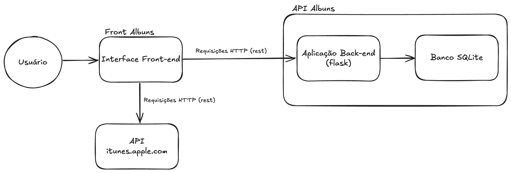

# Backend Acervo Musical

Projeto de MVP da sprint de Desenvolvimento Backend Avançado.
Baseado no meu projeto de Fullstack básico, este projeto consiste em uma estrutura de acervo de músicas, onde é possível registrar, listar, apagar e editar críticas de álbuns, os quais as informações são consultadas em uma api externa do itunes.

# Funcionalidades

Buscar álbuns musicais por título ou cantor;
Registrar uma crítica para um álbum;
Listar álbuns criticados;
Editar uma crítica;
Excluir uma crítica;

## Baixar o projeto

```bash
git clone https://github.com/FabioDouglass/api-albuns
cd api-albuns
```

## Rodar Projeto

1. **Construa e inicie os contêineres:**

   ```bash
   docker-compose up --build -d
   ```

   **Para encerrar os contêineres:**

   ```bash
   docker-compose down
   ```

   **Para rodar os contêineres:**

   ```bash
   docker run backend-avancado-api_api
   ```

## Acessar Documentação

Abra [http://127.0.0.1:5000/docs](http://127.0.0.1:5000/docs) no navegador

## URl para requisições

http://127.0.0.1:5000/album
http://127.0.0.1:5000/albuns

- **Listar todos os filmes:**

  ```http
  GET /filmes
  ```

- **Listar um filme por titulo**

  ```http
  GET /filme?titulo=$titulo

  ```

- **Editar a nota de um filme:**

  ```http
  PATCH /filme/{titulo}
  Body:
  {
    "nota": int
  }
  ```

  - **Deletar um filme por título:**

  ```http
  DELETE /filme/{titulo}
  ```

- **Cadastrar um filme:**

  ```http
  POST /api/filme
  Body:
  {
  "ano": int,
  "diretor": str,
  "nota": int,
  "titulo": str
  }
  ```

## Fluxograma da Arquitetura da serviço:

---


